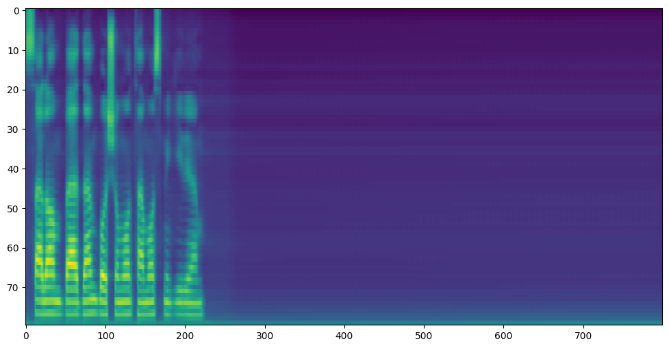
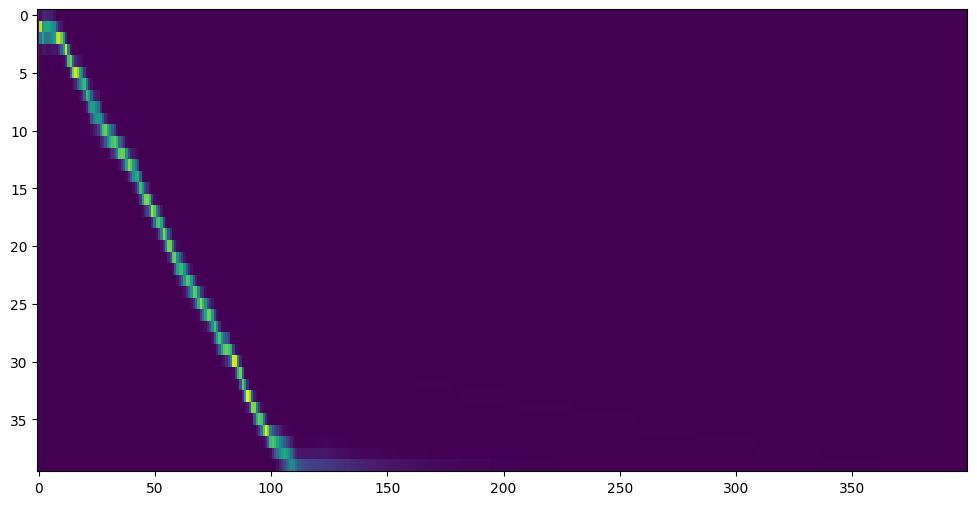

# Voice Generator Persian

Convert text to speak in Pesian language with Python


## Demo

[See demo voice](https://github.com/Omrani-Sina/voice-generator-persian/blob/main/voices/demo.wav)


## Installation

Install voice generator persian (*LINUX*)


[](https://python.org/)


```bash
  sudo apt update
```
- **and install espeak**
```bash
    sudo apt install espeak
```

## Run Project

Clone the project

```bash
  git clone https://github.com/Omrani-Sina/voice-generator-persian.git
```

Go to the project directory

```bash
  cd voice-generator-persian
```

Run main file

```bash
  python3 main.py
```


## Examples





## 🚀 About Me
I Love Python programming language / 
Windows programmer
(Sina Omrani)


[](https://github.com/Omrani-Sina)
